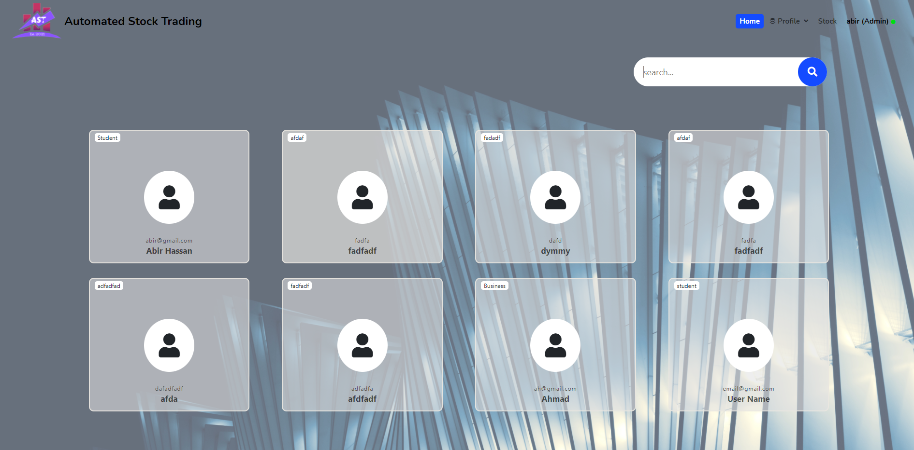

# Stock-Trading
 A django application for stock trading. (2021)

 This project is for an automated stock trading app using Machine Learning. Here users have future value predictions for the stock and which help them to choose which stock is best from them. It also has best valued stock and other features.
 

 ## Project description
Name: Stock-Trading  
Fronted Language: HTML, CSS, JS  
Backend : python (Django)  
Platform: WEB  
Project No: update me  
Year: 2021

## Features:
<ul> 
    <li>Guest home page.</li>
    <li>Login page (for user and admin).</li>
    <li>Signup page (for user). </li>
    <li>Terms and conditions. </li>
    <li>Privacy policy. </li>
    <li>Forget password. </li>
    <li>User homepage. </li>
    <li>My profile (user). </li>
    <li>Edit profile (user). </li>
    <li>All Stock view and search (user end). </li>
    <li>Single stock view(use end: prediction, indication and bot). </li>
    <li>My stocks. </li>
    <li>Sold stock. </li>
    <li>Admin home (user show with search). </li>
    <li>Logout (user and admin). </li>
    <li>My profile (admin). </li>
    <li>Add stock. </li>
    <li>View all users (table view with search). </li>
    <li>Single user view. </li>
    <li>User stock details (table view). </li>
    <li>All Stock view and search (admin view). </li>
    <li>Edit user profile and delete. </li>
    <li>Single stock view(Admin view: prediction, indication and update and delete). </li>
    <li>Update stock data. </li>
    <li>Session control for logged users. </li>
</ul>

## Demo Video
<!--  -->

## Screen shot

### Guest user
#### Home

#### Terms & Condition

#### Privacy Policy

#### Login

#### Singup

#### forget password

 
 

### User
#### Home

#### MyProfile

#### Edit Profile

#### MyStocks

#### Stock page

#### Single Stock view

 
 

### Admin
#### index

#### Login

#### Home (Showing user)

#### User Details

#### View Bidded Stock

#### MyProfile (Admin)

#### Showing user (List view)

#### Add Stock

#### Update Stock

## Authors

* **AbirHasan**

Check out my other works [@XAbirHasan](https://github.com/XAbirHasan)

